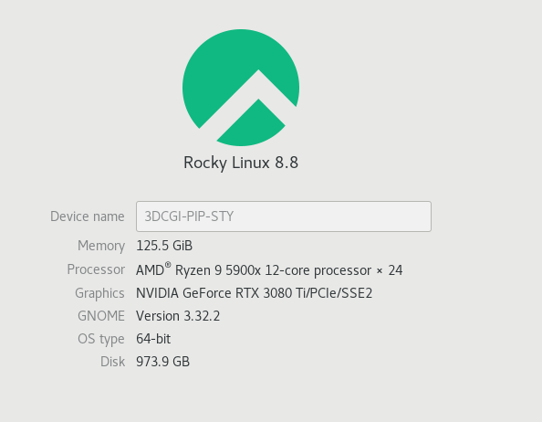
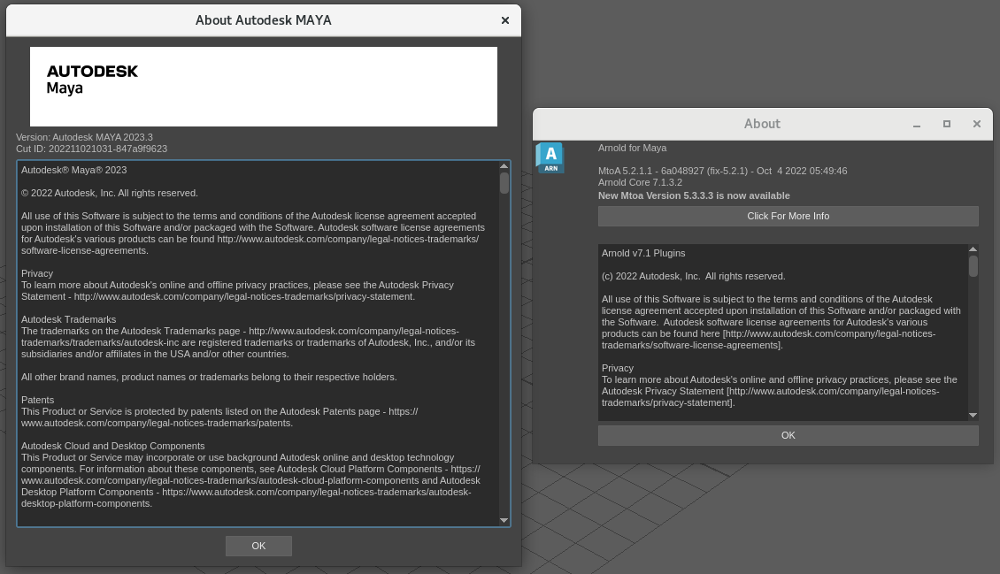
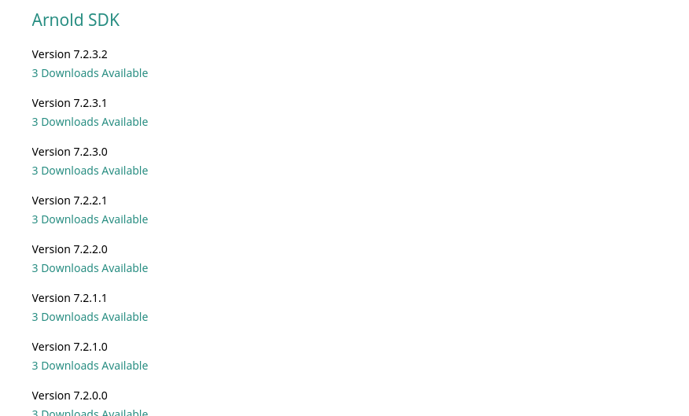
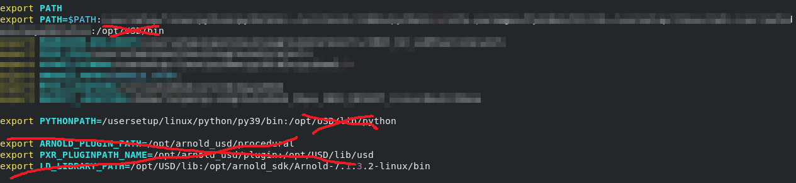
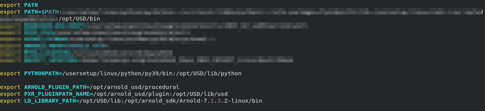
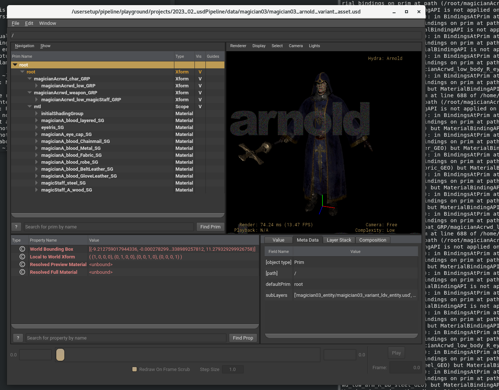

## 1. build enviroment

| OS : Rocky Linux            | Maya and Arnold | [Arnold SDK download](https://arnoldrenderer.com/download/archive/) |
| :---------------- | :------: | ----: |
|        |      |  |

| bashrc before build | bashrc after build | 
| :---------------- | :------: |
|   |      | 


</br>
</br>
</br>

## 2. How to
1. clone gits (OpenUSD / arnold-usd)
2. download arnold sdk
3. prepare python27 (not exists as default in rocky linux anymore)
4. do install python devel for pyconfig.h error
    ```
    dnf install python2-devel
    dnf install python3-devel
    ```
5. do build
    ```
    [OpenUSD]v23.08
    /usr/bin/python3.6 ./build_scripts/build_usd.py --force-all --build-shared --no-examples --no-docs --no-python-docs --ptex --openvdb --openimageio --opencolorio --alembic --hdf5 --materialx /opt/USD

    [arnold-usd]7.2.3.2
    cmake -DCMAKE_BUILD_TYPE=Release -DARNOLD_LOCATION=/opt/arnold_sdk/Arnold-7.1.3.2-linux -DUSD_LOCATION=/opt/USD -DCMAKE_CXX_STANDARD=14 -DBUILD_DOCS=false -DCMAKE_INSTALL_PREFIX=/opt/arnold_usd
    ```

* caution
    - Do not use python39 or other python verions with 'dnf install python3.X'
    - Use default python3.6 version
    - Reason : There is a conflict between python paths

6. use mayaUSD usdview to use
    ```
    {mayapy_path} /usr/autodesk/mayausd/maya2023/{mayausd_version}/mayausd/USD/bin/usdview {usd file}
    ```

</br>
</br>
</br>

## 3. Render result

