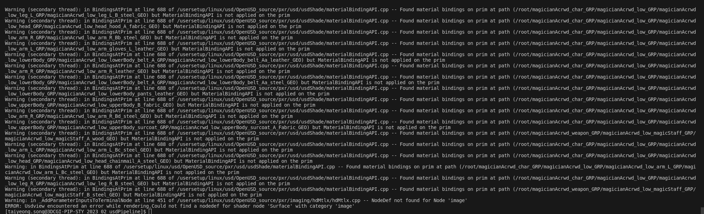

## Warnning Message 

 
 

## how to solve ?

1. check exported data in usdview --> there is no warnning message
2. compare between exported data and written data which is made by code
2. /usersetup/linux/usd/OpenUSD_source/pxr/usd/usdShade/materialBindingAPI.cpp --> cause : HasAPI 
3. find difference --> prepend apiSchemas = ["MaterialBindingAPI"]
4. Do -->  geo_prim.ApplyAPI(UsdShade.MaterialBindingAPI)